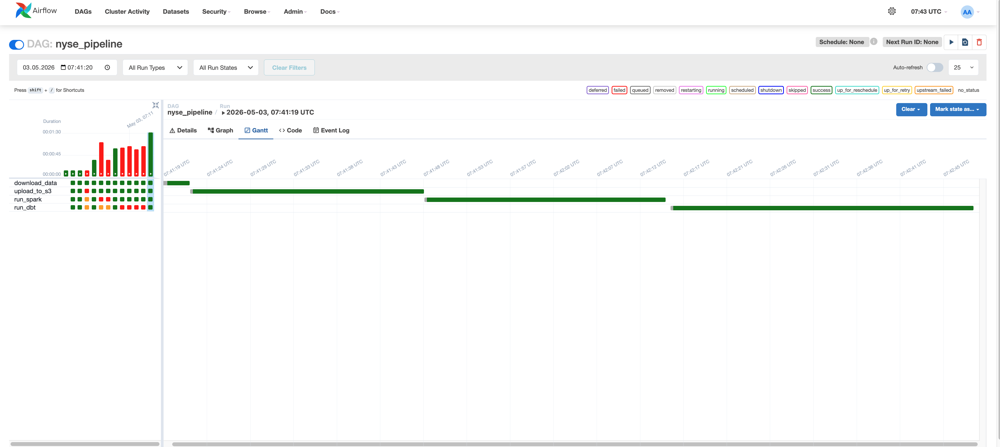
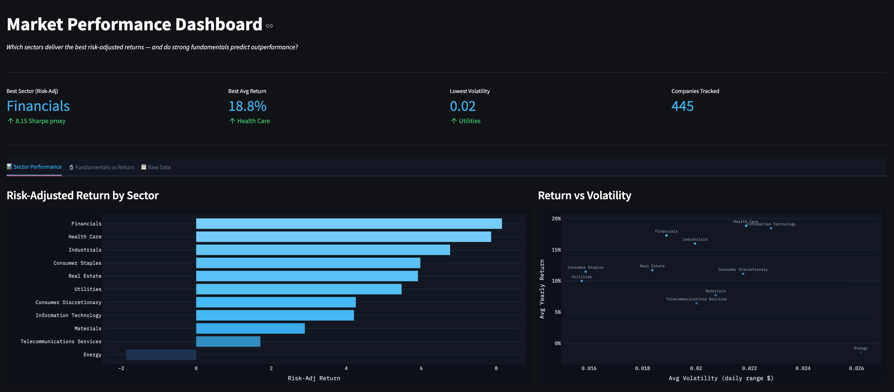
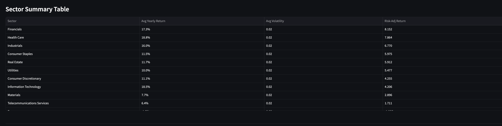
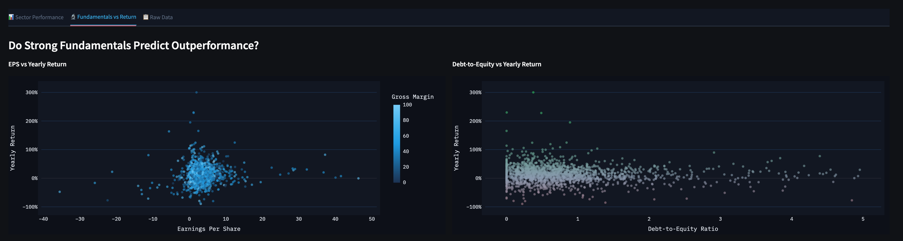
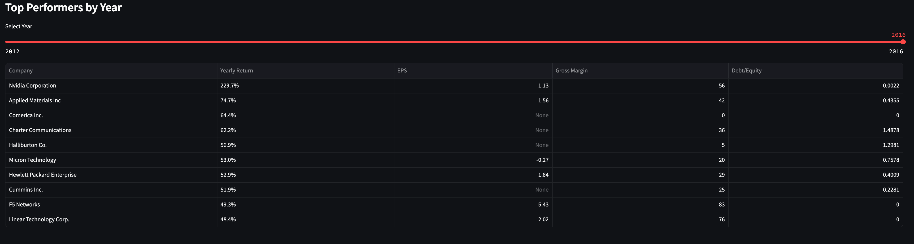

# NYSE Market Intelligence Pipeline

End-to-end data pipeline analyzing NYSE-listed companies (2012–2016) to answer:
**which sectors deliver the best risk-adjusted returns, and do strong fundamentals predict outperformance?**

Built with a modern AWS-native data stack: **Terraform · Airflow · Spark · dbt · Athena · S3 · Streamlit**.

---

## 📐 Architecture

```
┌──────────────┐     ┌──────────────┐     ┌──────────────┐     ┌──────────────┐
│   Kaggle     │────▶│      S3      │────▶│    Spark     │────▶│   Athena     │
│  (raw CSVs)  │     │ (raw zone)   │     │ (enrichment) │     │  (analytics) │
└──────────────┘     └──────────────┘     └──────────────┘     └──────┬───────┘
                                                                      │
                            Airflow orchestrates the full DAG          │
                            ┌─────────────────────────────────┐        │
                            │  download → upload → spark → dbt│        │
                            └─────────────────────────────────┘        │
                                                                      ▼
                                                              ┌──────────────┐
                                                              │  Streamlit   │
                                                              │  Dashboard   │
                                                              └──────────────┘
```



The full DAG runs in roughly 90 seconds end-to-end on local hardware — Spark is the longest task at ~30s due to the wide join.

---

## 🎯 Business Problem

Portfolio managers and equity analysts constantly face two questions:

1. **Sector allocation** — which sectors offer the best return per unit of risk?
2. **Fundamental analysis** — do traditional metrics (EPS, gross margin, debt/equity) actually correlate with stock performance?

The pipeline produces two analytical marts that answer these directly:

- `mart_sector_performance` — sector-level Sharpe-proxy ranking
- `mart_fundamentals_vs_return` — company-year level fundamentals vs realized returns

The Streamlit dashboard makes the answers explorable. The headline finding from the data: **Financials lead on risk-adjusted return (8.15), Health Care leads on raw return (18.8%), and Energy is the only sector with negative risk-adjusted returns** in the 2012–2016 window.



---

## 🗂 Why This Data Source

The pipeline uses the [NYSE dataset on Kaggle](https://www.kaggle.com/datasets/dgawlik/nyse) — a public, denormalized snapshot of S&P 500 constituents covering daily prices, fundamentals, and securities metadata for 2012–2016.

Why this dataset over alternatives:

- **Joinable out of the box** — prices, fundamentals, and security metadata share a `Ticker Symbol` key, which makes the multi-table enrichment realistic without licensing complications
- **Realistic shape** — 8 source tables, ~450 companies, ~850k price rows. Big enough to require Spark, small enough to iterate fast
- **Public** — no paid API keys, fully reproducible by anyone cloning the repo

The trade-off is that the data ends in 2016, so this is a backtest pipeline rather than a real-time one. The architecture itself would extend cleanly to live market data via an API source.

---

## ⚠️ Data Quality Issues Encountered

A few real problems surfaced during development that shaped the design:

**Row explosion on fundamentals joins.** The fundamentals table has multiple rows per company (one per fiscal period). A naive join blew up the price-level table by 4–5×. **Fix:** aggregate fundamentals to one row per company-year *before* joining, using window functions in the Spark job.

**Missing fundamentals.** Not every company has fundamentals every year — some appear in price data but were missing EPS or gross margin entries. Visible in the dashboard's "Top Performers" table where you'll see `None` for some companies.  **Decision:** keep the rows, let `null` propagate. The mart's purpose is exploration, not enforcing a strict schema.

**Outlier returns from low-priced stocks.** When `first_close` is small (e.g. $2), even modest absolute moves produce 200%+ "yearly returns" — Nvidia at 229% in 2016 is real, but the chart axis got warped by penny-stock survivors. **Fix:** the dashboard's fundamentals scatter clips EPS to ±50 and debt/equity to 0–5 for visual clarity, but the underlying mart is unfiltered.

**Volatility metric is a proxy, not a true σ.** I'm using `avg_daily_range / first_close` as a volatility stand-in because computing rolling daily returns requires the full time series. The marts surface a Sharpe-*proxy*, not a real Sharpe ratio. Honest naming matters here — `avg_risk_adj_return` makes no claim of statistical rigor.

---

## ✅ Tests

dbt schema tests run as the final step of every pipeline execution. The current suite:

| Layer | Model | Tests |
|---|---|---|
| Staging | `stg_stocks_enriched` | `not_null` on all key columns (symbol, year, prices, sector, company_name) |
| Intermediate | `int_stock_metrics` | `not_null` on identifiers + computed metrics (yearly_return, volatility) |
| Marts | `mart_sector_performance` | `not_null` + `unique` on `sector` |
| Marts | `mart_fundamentals_vs_return` | `not_null` on `company_name`, `stock_year`, `yearly_return` |

A failing test fails the `run_dbt` Airflow task, which means downstream marts never get marked "fresh." The dashboard is allowed to keep showing the previous successful run's data — staleness is preferred over corruption.

For production, I'd add custom tests for:
- Range checks (e.g. `gross_margin` between 0–100, `debt_to_equity` >= 0)
- Row count anomaly detection (alert if today's row count is <80% of yesterday's)
- Referential integrity between fundamentals and price data

---

## 🔄 Load Strategy

**Current state: full refresh.** Every pipeline run drops and rebuilds all dbt models from scratch via the `table` materialization. This is a deliberate choice for the dataset's scale (~1.7k mart rows) — incremental complexity isn't justified yet.

**What incremental would look like here:** the natural partition key is `stock_year`, so an incremental config would only re-process the latest year on each run:

```sql
{{ config(
    materialized='incremental',
    unique_key=['symbol', 'stock_year'],
    incremental_strategy='merge'
) }}
```

This becomes essential at scale (millions of rows) or for tighter SLAs. For a 5-year backtest with ~450 companies, full refresh runs in seconds — incremental would add complexity without measurable benefit.

---

## 💥 Failure Behavior

The DAG uses Airflow's default failure semantics with explicit task dependencies:

```python
download_data >> upload_to_s3 >> run_spark >> run_dbt
```

What happens at each failure point:

| Task fails | Effect |
|---|---|
| `download_data` | Pipeline stops. No S3 writes. Previous data remains queryable. |
| `upload_to_s3` | Spark + dbt are skipped. S3 raw zone keeps prior data. |
| `run_spark` | Athena tables retain previous values. dbt is skipped. |
| `run_dbt` | Athena raw layer is updated, but marts retain previous values. **Dashboard keeps working** with stale data. |

The Streamlit dashboard has its own caching layer (`@st.cache_data(ttl=3600)`) so a brief Athena unavailability doesn't take it down.

**What's missing:** no alerting. In production I'd wire `on_failure_callback` to a Slack webhook so a broken DAG isn't discovered when someone opens the dashboard.

---

## 💰 Cost Control

The whole pipeline runs on AWS free tier or near-zero spend. Specifically:

- **S3** — raw + Athena results. A few hundred MB total. Cents per month.
- **Athena** — pay-per-query at $5/TB scanned. The marts are tiny (~1.7k rows total), so a full dashboard refresh scans <10 MB. **Effectively free.**
- **Glue Data Catalog** — first 1M objects free.
- **Compute** — Spark and Airflow run locally in Docker. Zero AWS compute cost.

Three deliberate cost-control choices in the architecture:

1. **Parquet over CSV.** The Spark output is partitioned Parquet, which Athena scans columnarly. A query on `mart_sector_performance` reads kilobytes, not megabytes.
2. **Partition on the enriched table.** The Spark output is partitioned by `stock_year`. Athena prunes irrelevant year partitions before scanning, reducing bytes read on year-filtered queries.
3. **Athena workgroup with query result encryption** — keeps results in a single bucket with lifecycle rules for cleanup.

If this scaled to live tick data (terabytes/day), I'd add Athena query result caching and consider switching marts to Iceberg for time-travel and compaction.

---

## 📊 What the Dashboard Supports

The dashboard answers two practical questions for an analyst:

**1. "Where should I tilt my sector allocation?"**
The Risk-Adjusted Return chart ranks sectors by Sharpe-proxy. A defensive allocator sees Financials, Health Care, Industrials clustered at the top — high return, low volatility. A contrarian sees Energy at the bottom and asks why (oil price collapse 2014–2016 — a real story in the data).



**2. "Do fundamentals matter for stock picking?"**
The EPS-vs-return and debt/equity-vs-return scatters show the honest answer: **the relationship is noisy.** There's no obvious linear signal. This is a valuable finding — it tells the user that single-factor fundamental screens won't work, and that more sophisticated multi-factor models are needed.



The "Top Performers by Year" slider lets the user spot specific outliers (Nvidia 2016 +229%, Charter Communications 2016 +62%) and dig into whether those moves were predictable from the fundamentals alone — usually they weren't.



---

## 🚀 What I'd Change for Production

Honest list of gaps between this portfolio version and what I'd build for paying users:

**Reliability**
- Failure alerting via Slack/PagerDuty (`on_failure_callback`)
- Data freshness SLAs with `dbt source freshness` + alerts
- Idempotent S3 uploads (currently overwrites; should version)

**Correctness**
- Replace volatility proxy with proper rolling daily-return σ
- Add custom dbt tests for value ranges and row-count anomalies
- Schema contracts on the source — fail fast if Kaggle changes column names

**Scalability**
- Move dbt models to incremental materialization
- Replace local Spark with EMR Serverless or Glue
- Move Airflow from Docker Compose to MWAA (managed)
- Convert marts to Iceberg tables for ACID + compaction

**Security & Governance**
- Secrets in AWS Secrets Manager, not `.env` files
- IAM roles instead of long-lived access keys
- Streamlit behind authentication (Cognito or auth proxy)
- Lake Formation column-level permissions on sensitive marts

**Observability**
- dbt run artifacts persisted to S3 for lineage tracking
- CloudWatch metrics on row counts, query bytes scanned, DAG duration
- Data quality dashboard (test pass rates over time)

**Developer experience**
- CI/CD: GitHub Actions running `dbt build` against a staging schema on every PR
- Pre-commit hooks for SQL formatting (`sqlfluff`) and Python (`ruff`)

---

## 📁 Project Structure

```
nyse-market-pipeline/
├── airflow/
│   ├── dags/nyse_pipeline.py        # Main DAG: download → S3 → Spark → dbt
│   ├── Dockerfile                    # Custom image with dbt-athena in venv
│   └── docker-compose.yml
├── dbt/nyse_market_pipeline/
│   ├── models/
│   │   ├── staging/                  # stg_stocks_enriched
│   │   ├── intermediate/             # int_stock_metrics
│   │   └── marts/                    # mart_sector_performance, mart_fundamentals_vs_return
│   └── dbt_project.yml
├── spark/
│   ├── stocks_enriched.py            # 8-table join + window aggregations
│   └── Dockerfile
├── terraform/                        # S3 buckets + Athena workgroup + Glue databases
├── dashboard/
│   └── dashboard.py                  # Streamlit + PyAthena
└── docs/                             # Screenshots used in this README
```

---

## 🛠 Running It

Prerequisites: Docker, AWS credentials configured at `~/.aws/credentials`, `~/.dbt/profiles.yml` pointing to your Athena workgroup.

```bash
# 1. Provision infrastructure
cd terraform && terraform apply

# 2. Build and start Airflow
cd ../airflow && docker compose up -d --build

# 3. Trigger the pipeline (Airflow UI: http://localhost:8080)
# DAG: nyse_pipeline → Trigger DAG

# 4. Launch dashboard
cd ../dashboard && streamlit run dashboard.py
```

---

## 👤 Author

Selçuk Kaleli — [GitHub](https://github.com/selcukkaleli)

This is the third in a series of data engineering portfolio projects. Earlier projects:
- **Movie Investment Intelligence Pipeline** (GCP stack: Terraform, Kestra, PySpark, dbt, BigQuery, Looker Studio)
- **Olist E-Commerce Analytics** (same GCP stack, applied to Brazilian e-commerce data)